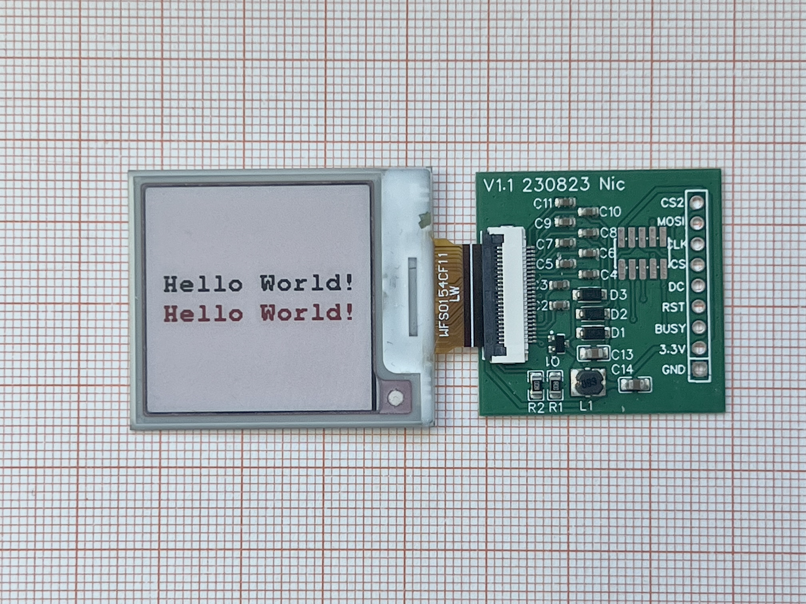

# epaper driver pcb
 e-paper driver PCB, schematic and example scripts for esp32

## What is it?
This is a ready-to-go PCB to connect a bare epaper display (salvaged from a used Electronic Shelf Label) to a microcontroller (like ESP32) via SPI.

## What makes it special?
The driver board is compatible with at least the Solum 2.9" and 1.54" displays. I didn't test any other displays or brands, but most displays are using the same pinouts and probably are usable.

The pcb is designed so you can almost make a straight connection to a ESP32 Lolin board. No other components are needed to make it work. On ESP32, you can use the GxEPD2 library or the Adafruit_EPD library to use the display. Examples for Arduino and PlatformIO are in this repository.

Buy the ready make driver pcb on Tindie: https://www.tindie.com/stores/electronics-by-nic/
There, I also sell the compatible displays.

How to connect:

| Driver | ESP32 |
| ------ | ----- |
| MOSI   | 23    |
| CLK    | 18    |
| CS     | 5     |
| DC     | 17    |
| RST    | 16    |
| BUSY   | 4     |
| 3.3V   | 3.3V  |
| GND    | GND   |

To connect to other MCU's, find the right pins for SPI communications. 
The CS2 pin connects to pin 1 of the display. Some larges displays use this pin as a slave chip select. Under normal circumstances you can leave this pin open.

Note: this board is only compatible with 3.3V signals! Don't try to use 5V boards with it, as it will break things beyond repair. Also, don't connect the driver board without attached epaper display.

